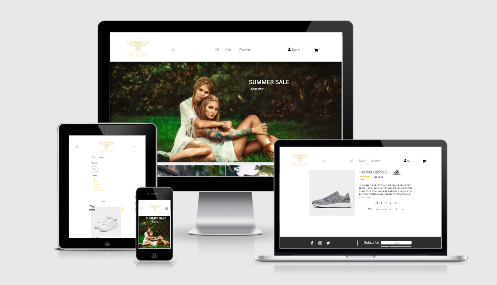
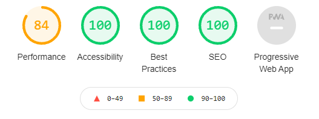
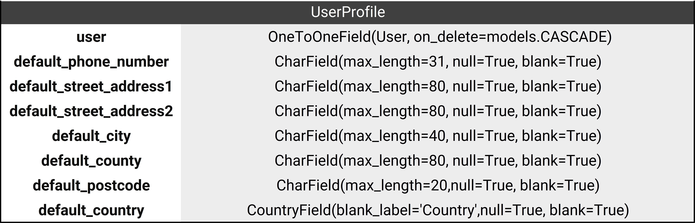
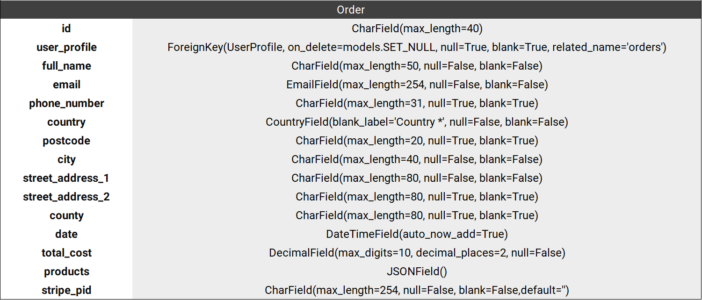
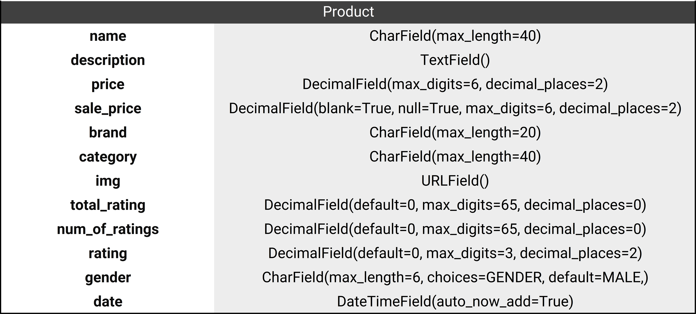

# Owl & Hoot

The fourth and final project in Code Institute Full Stack Developer program features an e-commerce fashion retailer called Owl & Hoot. It is designed to provide the full experience that a real online store would such as registering and making a purchase. The product database includes three famous brands with different products and categories. There is a possibility of adding many additional features and they will be added depending on viability and importance as well as the available time.

> Admin login credentials:  
Username: user  
Password: Superuser2021  
Website link: https://owl-and-hoot.herokuapp.com/

## UX

### User Stories

#### Users

- I want to be able to create an account.
- I want to view my profile and order history.
- I want the option to save default delivery information.
- I want to be able to add a product to basket and view it before going to checkout.
- I want to get email confirmation of the products that I ordered.
- I want to see the product rating.
- I would like to search for products and filter the brands I desire.

### Wireframes

[Homepage](static/images/readme_images/homepage.png)

[Product list](static/images/readme_images/product_list.png)

[Product page](static/images/readme_images/product_page.png)

[Basket](static/images/readme_images/basket.png)

### Colors

These are the main colors on the website. I wanted a more serious look for this project and have chosen the colors that seemed in line with that goal. There are slight variations to the #FEDE67 color which is used for certain buttons and borders. The goal was to make the logo the same color but it was not visible enough and the shade was changed and darkened. There are also buttons which use Bootstrap colors so I did not include hex codes. Some of them could potentially be improved so the colors better match the website theme. It is only for the buttons that are shown to the admin when adding/deleting products so I left them red and green for better indication of the action taken. The #2E2E2E is used for the footer and the #EEEEEE is used as a background for certain headlines.

### Fonts
The main font on the website is Roboto and it is used on almost all elements. The look is adjusted by adding different font weights and capitalization. Add to cart form on the product page is the only element that has Source Sans Pro for font instead of Roboto. It seemed a bit more serious and works well together.

### Icons
All icons on the website have been taken form [Flaticon](https://www.flaticon.com/) and licenced.

### Product source
The products including all descriptive data as well as the images has been taken from [JD Sports Ireland](https://www.jdsports.ie/?gclid=CjwKCAjw3riIBhAwEiwAzD3TiUo9NHUbjYNF8Qlmg0SqdBPJYEm9ocl4K_euLb1jSKqI_jryyi0-7hoCHzcQAvD_BwE&gclsrc=aw.ds#). I would not usually do so but this project is for educational purposes only and no transactions are possible.

## Technologies used

##### Languages, frameworks and more
 HTML5 - webpage markup language for basic structure

 CSS3 - HTML document styling language 

 Bootstrap - CSS framework with focus on responsive design

 JavaScript - behavior of elements on the website 

 jQuery - JavaScript library

 Python - backend programming language working together with Flask, MongoDB and Heroku

 Heroku - cloud deployment platform

 Amazon Web Service - static file hosting

 Django - high-level Python web framework enabling rapid development

##### Repository, coding environment and version control

- [Gitpod](https://www.gitpod.io/) - coding environment
- [Git](https://git-scm.com/) - used for version control
- [Github](https://www.gitpod.io/) - hosting platform for managing repositories and more

#####  Resources and packages

- [Flaticon](https://www.flaticon.com/) - used for icons
- [Pexels](https://www.pexels.com/) - homepage images
- [Google Fonts](https://fonts.google.com/) - source for all fonts on the website
- [JD Ireland](https://www.jdsports.ie/) - source of all products including images and descriptions
- [Ezgif](https://ezgif.com/) - image optimization
- [Am I Responsive](http://ami.responsivedesign.is/) - responsive devices view on top of website
- [Tilt.js](https://gijsroge.github.io/tilt.js/) - tilt effect in top brands section
- [django-json-widget](https://github.com/jmrivas86/django-json-widget)- JSON format for products in the admin

## Testing

### User stories testing

User stories have been updated for the reasons stated in the final notes. As such, all the bases have been covered and do not need further testing. The features that were initially supposed to be included are:

- The ability to delete a profile
- Multiple product images
- The option to leave a review

### Features and tests

#### Navigation  

- Search  
The search bar should open and close with animation and highlight the send button on user input. It should redirect to the category page with the searched products or a paragraph saying none were found.

The search finds products with any of the queried words in any part of the product name or category. If a brand is searched for, a brand filter is added. The brand part of the query is ignored as searching for brand jeans would also include other categories with the brand in the name. The gender filter is also ignored if not accompanied by additional queries for the same reason. I have included the synonyms for products that are available on the website e.g. searching for trousers includes a search for the products in the list ['jeans', 'trousers', 'pants', 'denim'].

> The search works as intended with possible improvement of finding similar results if no products are found.

- Navigation  
Navigation is responsive and all links lead to the appropriate locations. The links are also changing depending on login status as intended.

> The navigation close animation sometimes lags on the homepage

#### Homepage

- Hero and collection sections  
The sections lead to the right pages and are responsive, the hero offer text moves smoothly regardless of device.

- Top brands  
The hover animations are implemented with tilt.js and work as intended. The links lead to the category page with the brand filter toggled.

> Possible improvements are a bit more variety on the homepage as all the sections now just lead to a different filter in the category page.

#### Add/edit product

- The page is restricted to the admin only and cannot be bypassed by entering the link. Adding a product adds it and refreshes the page since there might be more products to add. Editing a product leads to the edited product page to see the results. I have added the rating field as well since rating by users has not been enabled.

#### Categories

- Filter  
The filter adds display none to the products not included in it and only shows the products whith the combined filter if both selected. Clearing the filter removes all filters as intended.

> Possible improvements: the filter should include more filtering options such as categories, price range and more. Under the filter headline, there should be all the selected filters as it was imagined in the wireframes. 

- Sorting
Sorting should take all the products, rearange them according to the filter and show the new order. There is a bug for sorting while logged in as admin because I did not take the admin controls into consideration when making it. It has therefore been removed for admins which should not be too big of an issue.

>  Possible improvements include more sorting options and making it screen reader accessible.

- Product list  
Product list shows the correct procucts in regard to the category/filters selected and is fully responsive.

> Possible improvements include category sections for types of products, pagination and last product in the list aligned left.

#### Product

- The page shows the correct product details and is fully responsive. There are sizes available as well as the quantity selector which can only be submitted in 1-99 range.

> The intention was to include more product types and the sizes should probably be in numbers instead of letters. There should also be a stock counter showing unavailable sizes.

#### Cart

- The cart is a small window showing on the right when opened. It is fixed to the same position and fully responsive. On update it reopens to show the updated quantity or no products if none in cart. It only allows update in 1-99 range. If cart is empty, it also redirects form the checkout page. 

> Possible improvements include showing price for discounted items in red and only showing the update button for products that had the quantity changed.

#### Checkout

- Payment  
Payment is implemented trough Stripe. If the user closes the window before it is complete, the webhook finishes the payment and creates the order in the system. Since it is a Stripe functionality, all addidtional security features are included and errors are shown. Saving the info to profile is only shown to logged in users and works as intended.

- Cart preview  
The preview basically just shows the cart in a bigger screen before a purchase. There is an edit cart button that shows the 

- Checkout success  
Checking out successfully creates an order summary that gets sent to the users email as intended.

#### Profile

- Saving the profile information works as intended and validates the fields in the same way they would be validated on the checkout page. Order history shows the correct orders or no orders if none. For each order, there is a link which shows the same confirmation that was rendered on purchase. There is a log out button included and a product management button which is only shown to superusers.

#### Allauth templates

- Templates have been customized and are fully responsive. For the registration to be successful, the user needs to confirm the email.

#### Footer

- The links lead to correct websites and open in a new tab. The subscribe section is only for illustrative purposes.

> Possible improvements are to add the subscribe functionality.

#### Additional

- Class template filter  
I wanted to add the forms as you normally would and have created a filter to add class to template elements. In some forms I went the long way of adding it to each field before I realized I could just loop trough the inputs and labels and easily add the appropriate classes.

- Loop template filter  
I had issues getting the total count when looping trough the product prices in a nested loop on the cart page. The filter keeps track of it in order to get the correct price of each product in a list. 

#### Possible future features

There are so many potential features that I could probably work on the project for another two months. They are all the improvements mentioned above plus: discount promo codes, product comments, whishlist, social media login, discount countdown and more.

### Code validation
##### HTML
##### CSS

#### Javascript
> [Beautify Tools](https://beautifytools.com/javascript-validator.php) validation passed with no errors. There is an eval warning which does not seem to be an issue since the code is trusted.
##### Python
> Code is PEP8 compliant and validation only shows Django created file errors
### Browser Compatibility

The website was developed on Chrome and tested on Mozilla, Edge and Opera for desktop. There are no changes to the user experience apart from a small change on the product input field which was fixed using CSS. All the CSS prefixes have been added by autoprefixer.

Website works well on Samsung internet for mobile and tablets as well. There is a slight issue with the menu animation on the home screen. I suspect it has to do with the hero section paragraph having a sticky position.

As for the Lighthouse score, it is pretty good apart form the performance section in which the images could use optimization. I have optimized most images by reducing the quality and transforming them into webp.

### Accessibility

#### Testing
General accessibility was tested using the [WAVE](https://wave.webaim.org/) evaluation tool. The main page shows the headlines as having a low contrast. When inspecting the contrast in DevTools, it says no contrast information available. I assume since an image is a background, it does not recognise it. Otherwise, the headlines have a large font and should be visible. Other elements mostly satisfy the AAA contrast ratio with some satisfiying the AA ratio. All images have an alt tag apart from some which do not need it. For example rating stars do not as the rating is shown in text form.

#### Screen readers
The goal was to make the website easily navigatable by a screen reader. I have used the [Screen Reader](https://chrome.google.com/webstore/detail/screen-reader/kgejglhpjiefppelpmljglcjbhoiplfn) extension from Chrome to test the navigation. Idealy, JAWS would be used, but it is not free. The homepage can be navigated using tab completely. The nav has a skip to main content link at the beginning. It does not work perfectly becuse the reader reads skipped instead of the section name, but it was the only way I could get it to focus the right section of each page with some javascript. The filter on the category page also has a skip filter link which skips to the product list. I have ignored the sorting for now as the menu does not open using enter. The product list section has the products information as an aria label. I have not managed to add the neccessary labels and tabidexes to other pages.

## Database schema
 

The UserProfile model is a subclass of the Django [User model](https://docs.djangoproject.com/en/3.2/ref/contrib/auth/#fields) that sets default user information. As the information needs to be associated with a User, in case of deletion, the corresponding UserProfile instance is deleted as well.  
***

The Order model has a ForeignKey of UserProfile. If a profile is deleted, the field will be set to null as we still need to keep the order in the system. The products in the order are set as a JSONField which shows quantities and sizes for each product. The field is formated in the admin by [django-json-widget](https://github.com/jmrivas86/django-json-widget) for better readability.  
***

The Product model has no relational keys as its needed values are transformed into a dictionary and saved. If a product gets deleted, it is automatically removed from all the carts that it was in via the context. The intention behind the rating fields is to enable users to rate the product, but I am unsure if I will have the time to add that functionality.  
***

## Deployment

### Heroku
1. Create a new app on the Heroku website and choose the region in which most of your users reside.

2. Select the Add-ons window and add Heroku Postgres. To use Heroku Postgress make sure to `pip3 install dj_database_url` and `pip3 install psycopg2.binary` from your project terminal (don't forget to update the requirements file).

3. Go to the Heroku settings tab and copy your database URL from Config Vars section. Make it the default database in your project Django settings with `'default': dj_database_url.parse(your_url)`  
Make migrations and migrate. If you get the `django.db.utils.OperationalError: FATAL:  role "some_role"  does not exist`, you can fix it by using `unset PGHOSTADDR` command.  
Before pushing to GitHub make sure to change the default database to `'default': dj_database_url.parse(os.environ.get('DATABASE_URL'))` as not to expose it.

4. Install gunicorn web server `pip3 install gunicorn`  
Create Procfile and add `web: gunicorn your_project.wsgi:application`

5. Log in to Heroku from the terminal `heroku login`. If error forbidden shows up, use `heroku login -i` instead.  
Temporarily disable Heroku's static file collection with `heroku config:set DISABLE_COLLECTSTATIC=1 --app your_heroku_app_name`
Add hostname of your Heroku app in settings: `ALLOWED_HOSTS = ['your_app_name.herokuapp.com', 'localhost']`

6. If app created trough the website initialise git remote: `heroku git:remote -a owl-and-hoot`  
Push your changes to Github and then to Heroku: `git push heroku master` (could be main instead of master depending on your branch). 

### AWS

1. Create and verify an AWS account. After logging in search for S3 scalable storage and create a bucket selecting the apropriate region again. Make sure to unblock all public access and tick the confirmation box at the bottom.

2. After creation is confirmed select the created bucket to customize settings. Go to the bottom of the properties to Static website hosting. Enable it and under Hosting type select host a static website. Fill the index and error document sections with placeholders as it will not be needed.

3. Go to the permissions tab CORS section and paste the following configuration `[{"AllowedHeaders": ["Authorization"], "AllowedMethods": ["GET"], "AllowedOrigins": ["*"], "ExposeHeaders": []}]`

4. In the same tab, select Bucket policy section and then Policy generator. Set policy type as S3 Bucket Policy. Allow all Principals by entering a * in the field and select GetObject action. Go back to the Bucket policy section and copy your Bucket ARN, pasting it into the appropriate policy generator field. Add statement, generate policy and paste the result back in the Bucket policy section while adding a /* after your app name in the resource key.

5. After saving the policy, go to the Access control list section and tick the List box under Everyone (public access) section which will finish the setup.

6. In the search bar, search for Identity and Access Management (IAM). Select user groups from the dropdown, name and create a group. 

7. Select policies from left-side dropdown and create a policy. Select the JSON tab and import managed policy button. Select AmazonS3FullAccess policy and import it. Copy your ARN again from the Bucket policy section and replace the resource key with a list containing your ARN and the ARN followed by /* which will refer to all the files in your bucket. With that done, click review policy, name and create it.

8. Go back to the group created in step 6 and under Permissions tab, select add permissions - Attach Policies, attaching the created policy.

9. Select the users choice from dropdown to add a user to the group. Name the user and tick Access key - Programmatic access box. Clicking next add user to the needed group in the table. Finalize adding user and download csv file before closing.

### Connecting Django, Heroku and AWS

1. In the terminal `pip3 install boto3` and `pip3 install django-storages`. 

2. Add "storages" to your settings, installed apps. Also add the AWS variables which I will not list here, but you can find them my settings file. Remember to change your AWS region if needed. These variables also need to be added to Heroku and can be found in the downloaded csv file. Make sure to keep them secret. Also, remove the DISABLE_COLLECSTATIC variable.

3. Create custom storages file, you can refer to my own and add static files config in settings file.

4.  just confirm your superuser email and add Stripe keys to Heroku. With that done, deployment is complete,

## Commit messages

The commit messages follow conventional commit format: **type(optional scope): description**. Here are the commit message types used in this project:  

- fix: bug fixes
- feat: new features
- docs: adding content to README
- style: adding comments, spaces and other style changes
- refractor: editing code but not functionality e.g. renaming a variable

## Final notes

There are a lot of improvements that can be made and potential features that can be added. Starting the project I have underestimated the complexity of it which made me aim for some unrealistic goals at the beginning. That is why I have updated the user story section at the end. The final version did not really cover the stories set at the beginning, but it did cover some which I could not percieve when starting. My goal was to do the project completely on my own without relying on the Butique Ado project. It was working well up to about the Stripe section at which point the deadline was nearing and I had to start watching the videos and getting the code from there. Some parts were copied, while some had to be modified to fit the code written up to that point. Overall, I have really enjoyed the coding process and have learned a lot about Django.
